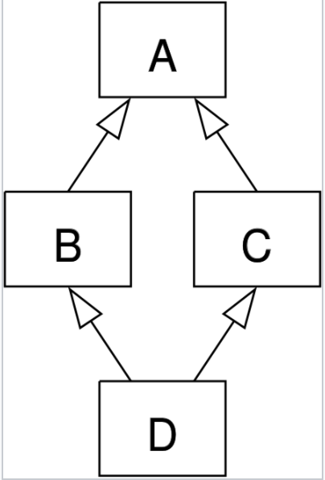
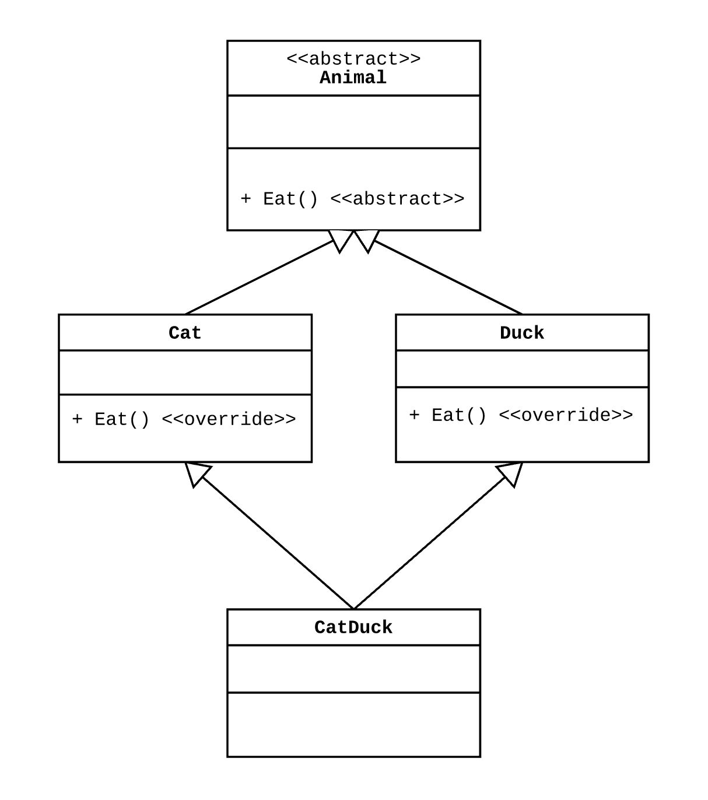
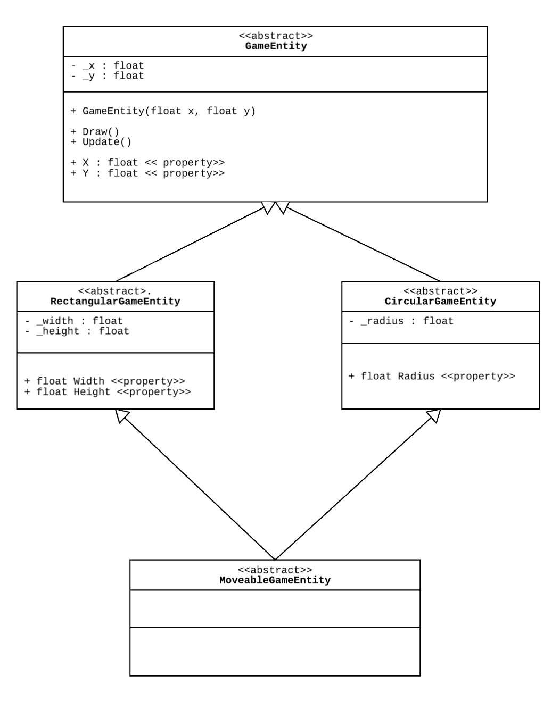
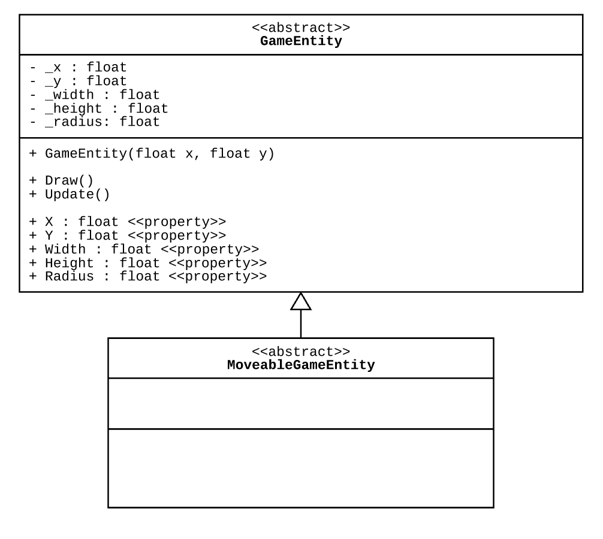
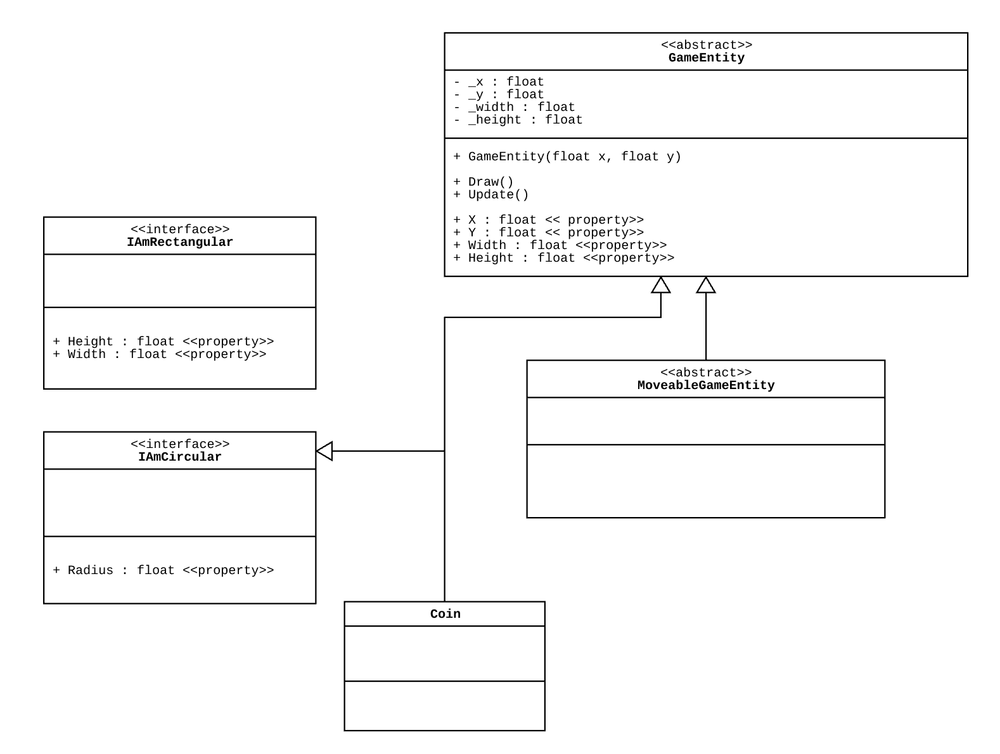
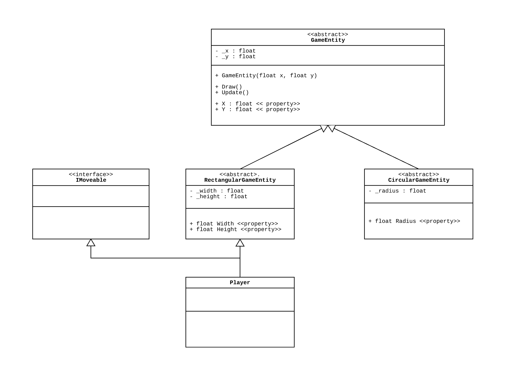
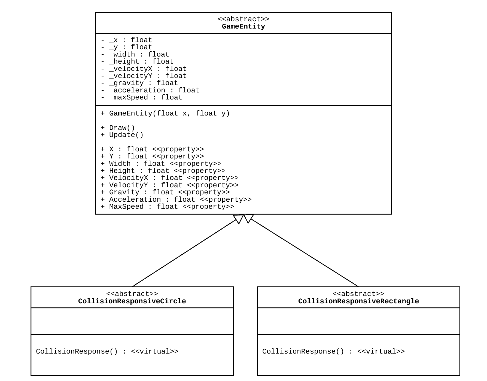

In this report I will be discussing multiple inheritance and its applications in the context of an object-oriented program. It’s usage has been described as controversial (Cargill, 1991), with its main criticisms being that it causes solutions to become more complex than necessary, and that it easily creates ambiguity in class relationships. There are very few inherently ‘good’ or ‘bad’ things in programming, despite how it may seem when programmers viciously reject or embrace certain ideas, as very few of these ideas are truly and objectively ‘bad’. Yet, even history tends to point out that multiple inheritance is a genuinely poor feature, as it has been dropped by modern languages almost completely (Maioli, 2017). I aim to find out whether there are there situations where multiple inheritance is acceptable, and if there is a case where it seems like a promising solution, what can be done to workaround it if it cannot be implemented in the language.

The “diamond problem”, also called the “diamond of death”, is the main issue that can arise from multiple inheritance designs:

>_When two classes B and C inherit from A, and class D inherits from both B and C ... if there is a method in A that B and C have overridden, and D does not override it, then which version of the method does D inherit: that of B, or that of C?_ (Wikipedia, 2017)
>
>

It is called this because of the diamond shape made by the class diagram. Here is an example I have adapted from the “Gentle Logic” developers blog (2013) that discusses this problem and attempts to resolve it:

Let’s say I have two classes called Cat and Duck that are derived from an Animal class. I then want to make a third class that is intended to act both as a Cat and Duck as some sort of catduck hybrid creature. An inexperienced object-oriented programmer might naturally choose to solve this problem with multiple inheritance, which would result in the diamond problem since both cat and duck have an overridden `eat()` method, so which one does catduck use?

There are two main ways to resolve this situation and still have an object which acts like a cat and duck concurrently.

The first involves favouring “Composition over Inheritance”, which is an object-oriented programming principle that says that “classes should achieve polymorphic behaviour and code reuse by their composition (by containing instances of other classes that implement the desired functionality) rather than inheritance from a base or parent class” (Wikipedia, 2017). The solution here is to have the third object be a kind of ‘Cage’, where the functionalities for both animals are embedded into this single entity, such that if we want to use cat behaviour, then we release the Cat, and if we require Duck behaviour, we release the Duck.

The second method is to use multiple Interfaces that each describe the Cat and Duck abilities and we tell the third class that it must implement all those features, such as IPurrable, IQuackable, and so on.

In C++ a pure abstract class has no data and no declarations for it’s member functions, and is hence “_a way of forcing a contract between the class designer and the users of that class_” (WikiBooks, 2013), which is practically what interfaces achieve in Java and C#. 
In C++, multiple inheritance is also allowed. With this in mind, I now want to explore an interview with Bjarne Stoustrup (Venners, 2003), the creator of C++, where he was asked, “_what is the advantage of using pure abstract classes? What is an appropriate situation to use them versus the more general case of multiple inheritance?_” Bjarne first said that the obvious benefit of interfaces is the guarantee of single implementation, which means that at most there is only one implementation of any method at any level in the inheritance hierarchy. In his next point, Bjarne said that in a situation where “_you need to inherit state from two classes ... if those classes are complicated or if the semantics of the two classes interact, you can easily get a mess_”. This is exactly the type of mess that would have occurred in the above Cat and Duck example due to the ambiguous `Eat()` method.

Bjarne also mentioned a completely valid case for multiple inheritance: “_Another common use of multiple inheritance is when you just want to combine a couple of classes that you happen to have. They don't have complicated semantics, so here the use of multiple inheritance is just a convenience._” What he is referring to here is where two classes have **orthogonal behaviours**, which is where parents are completely separate from one another. This is the best case scenario for multiple inheritance as the child class doesn’t end up with a mix-up or responsibilities (Maioli, 2017). I thought that I had arrived at such a scenario in one of my projects.

This is the class diagram I had wanted to deploy in my 2D platform game, which was not possible due to C#’s single inheritance policy. I initially believed that `RectangularGameEntity` and `CircularGameEntity` were orthogonal in nature and so needed to be separated, but also brought in again so they could be extended with the same set of functionality.

My inheritance hierarchy started with the base class which let the entity draw itself to a position on the screen and update itself, while the next level added the functionality to move, and the one after that added additional properties and methods for collision response. It was not necessary for me to figure this conundrum out completely for my game due to the fact that there were no moving circular entities, however for the sake of future extensibility it is something I want to now attempt to solve as part of this report. Following the example given about the Cat and Duck classes and with everything else that has been discussed so far, I could create these three solutions:

#### Solution #1 - Composition over Inheritance

I fear this is in violation of Liskov’s Substitution Principle, which says that any inheriting class must have a strong ‘is-a’ relationship with it’s parent. Since only the radius, or the height and the width, will be used by the child class at any one time, this might be bad design. “_LSP says we cannot mess with, or shift around, any data that_ 'belongs to' _the superclass_” (FeepingCreature Blog).

 
#### Solution #2 - Interfaces, version 1

This example uses a Coin entity.

 
#### Solution #3 - Interfaces, version 2

If there are other moving rectangular entities like Player, a generalised class called MoveableRectangularEntity could be created, which Player and other entities could inherit from. I did not implement this because I thought it was important for the update code, which helps define the world’s physics, to be standardised across all it’s implementations, and did not wish to rewrite this for every implementation.

Using interfaces like this solves the diamond problem, as discussed, however one of it’s downfalls is that it does not allow for any kind of inheritable implementation. Here is a quote from Katie Lucas, a London-based C++ programmer:

>_“I use [multiple inheritance] for adding a lot of genericity to things without needing to add code to every use of it ... Whenever I go near SI languages, I find myself spending a lot of time writing a lot of code over and over again in order to get polymorphic behaviour to inherit so I can reuse stuff, which seems like a waste of time to me.”_ (WikiWikiWeb, 2014)

Most languages have mitigation strategies to deal with problems of repeated inheritance. As we have seen, C# has its Interfaces, but Ruby makes it a little easier and a bit more in line with what Lucas wanted. Ruby has mixins, which are classes that have methods that can be used by other classes without having to be a parent of that class, reducing code duplication. This is a step-up from the virtualized multiple inheritance you can achieve offered by C#, however mixins do not provide a contract to their inherited class that says their methods must be implemented. Perl has a way of using multiple inheritance without running into the diamond of death issue. The parent classes of a class are listed in order, and the compiler will use the first method it finds. Python does the same thing (Wikipedia, 2017).

Despite all this, multiple inheritance is still frowned upon, because it generally indicates that there is a serious flaw in one’s class design. “_[Multiple Inheritance] relationships are the results of a inexperienced design for classes. Basically, avoiding multiple inheritance is a way to help beginning developers avoid shooting themselves in the foot_”. (StackExchange, 2017)

Perhaps my desire for multiple inheritance and multiple inheritance-like behaviour in my game stemmed from poor abstraction, and so the focus perhaps should not be on implementing multiple inheritance, but in reconsidering my abstraction of the problem.

Firstly, perhaps all game entities should have a physics implementation by default and be able to move and interact with other game entites, even if they choose to not move at all. For any game entity to exist in the game environment, it must obey the game’s laws of physics. Since circle’s have a different collision response mechanism than rectangles, this is where it would be appropriate to branch out. Another inheritance branch could stem out for composite shapes as well. This reconsideration of the problem leads to this new class design, eliminating any desire for multiple inheritance:

In conclusion of this report, it appears that desire for multiple inheritance often comes from a poor abstracted class design in the first place, and indicates that redesign must take place. Only if the classes are truly orthogonal in nature is multiple inheritance a good choice. These wise words from Bjarne Stoustrup provide a perfect summation of this conclusion and all the ideas discussed so far, and serve as good exit point from this report.

>“_People quite correctly say that you don't need multiple inheritance, because anything you can do with multiple inheritance you can also do with single inheritance. Furthermore, you don't need any inheritance at all, because anything you do with single inheritance you can also do without inheritance by forwarding through a class. Actually, you don't need any classes either, because you can do it all with pointers and data structures. But why would you want to do that? When is it convenient to use the language facilities? When would you prefer a workaround? I've seen cases where multiple inheritance is useful, and I've even seen cases where quite complicated multiple inheritance is useful. Generally, I prefer to use the facilities offered by the language to doing workarounds._” (Venners, 2003).

---

#### References

Cargill, T. A. (Winter 1991). "Controversy: The Case Against Multiple Inheritance in
C++". Computing Systems. 69–82.

Mailoli, Christian. (2017). “4 forgotten code constructs: Time to revisit the past?”. Available at: [https://techbeacon.com/revisiting-forgotten-code-constructs.](https://techbeacon.com/revisiting-forgotten-code-constructs) (Accessed 11 November 2017).

Wikipedia. (2017) “The diamond problem”. Available at: [https://en.wikipedia.org/wiki/Multiple_inheritance#The_diamond_problem.](https://en.wikipedia.org/wiki/Multiple_inheritance#The_diamond_problem) (Accessed 11 November 2017)

Gentle Logic. (2013) “Why Multiple Inheritance is Bad”. Available at: [http://gentlelogic.blogspot.com.au/2013/08/why-multiple-inheritance-is-bad.html.](http://gentlelogic.blogspot.com.au/2013/08/why-multiple-inheritance-is-bad.html) (Accessed 11 November 2017)

Bill Venners. (2003) “Modern C++ Style: A Conversation with Bjarne Stroustrup, Part II”. Available at: [http://www.artima.com/intv/modern.html.](http://www.artima.com/intv/modern.html) (Accessed 11 November 2017)

WikiBooks. (2013) “C++ Programming/Classes/Abstract Classes/Pure Abstract Classes”. Available at: [https://en.wikibooks.org/wiki/C%2B%2B_Programming/Classes/Abstract_Classes/Pure_Abstract_Classes.](https://en.wikibooks.org/wiki/C%2B%2B_Programming/Classes/Abstract_Classes/Pure_Abstract_Classes) (Accessed 11 November 2017)

FeepingCreature. “why single-inheritance multiple-interfaces oop is the most beautiful thing”. Available at: [https://feepingcreature.github.io/oop.html](https://feepingcreature.github.io/oop.html) (Accessed 11 November 2017)

Wikipedia. (2017) “Composition over inheritance”. Available at: [https://en.wikipedia.org/wiki/Composition_over_inheritance#cite_note-2](https://en.wikipedia.org/wiki/Composition_over_inheritance#cite_note-2) (Accessed 11 November 2017)

StackExchange. (2013) “Is there any ‘real’ reason multiple inheritance is hated?” Available at:
[https://softwareengineering.stackexchange.com/questions/218458/is-there-any-real-reason-multiple-inheritance-is-hated.](https://softwareengineering.stackexchange.com/questions/218458/is-there-any-real-reason-multiple-inheritance-is-hated) (Accessed 11 November 2017)

WikiWikiWeb. (2014) “Multiple Inheritance Is Not Evil”. Available at: [http://wiki.c2.com/?MultipleInheritanceIsNotEvil.](http://wiki.c2.com/?MultipleInheritanceIsNotEvil) (Accessed 11 November 2017)

