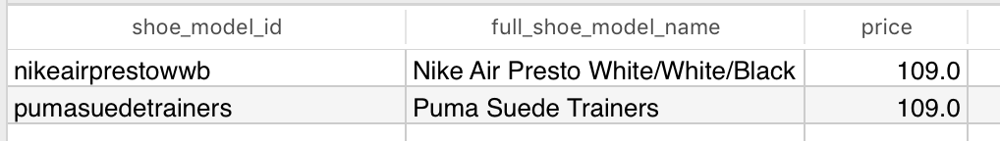

&nbsp;1. [Introduction](#introduction)  
&nbsp;2. [SQL Statements and UML Diagram](#source)  
&nbsp;3. [Database Usage Guide](#walkthrough)  
&nbsp;&nbsp;&nbsp;&nbsp;&nbsp;3.1. [Employees](#employees)  
&nbsp;&nbsp;&nbsp;&nbsp;&nbsp;&nbsp;&nbsp;&nbsp;&nbsp;3.1.1. [Ordering from the Vendor](#3.1.1.)  
&nbsp;&nbsp;&nbsp;&nbsp;&nbsp;&nbsp;&nbsp;&nbsp;&nbsp;3.1.2. [Registering Shipment Items from the Vendor](#3.1.2.)  
&nbsp;&nbsp;&nbsp;&nbsp;&nbsp;&nbsp;&nbsp;&nbsp;&nbsp;3.1.3. [Cataloging Shipment Items](#3.1.3.)  
&nbsp;&nbsp;&nbsp;&nbsp;&nbsp;&nbsp;&nbsp;&nbsp;&nbsp;&nbsp;&nbsp;&nbsp;&nbsp;3.1.3.1 [Grouping](#grouping)  
&nbsp;&nbsp;&nbsp;&nbsp;&nbsp;&nbsp;&nbsp;&nbsp;&nbsp;&nbsp;&nbsp;&nbsp;&nbsp;3.1.3.2 [Receiving an Order for an Already Cataloged Shoe](#3.1.3.2)  
&nbsp;&nbsp;&nbsp;&nbsp;&nbsp;3.2. [Customers](#customers)  
&nbsp;&nbsp;&nbsp;&nbsp;&nbsp;&nbsp;&nbsp;&nbsp;&nbsp;3.2.1 [Browsing and Adding Items to Cart](#browsing-and-adding-items-to-cart)  
&nbsp;&nbsp;&nbsp;&nbsp;&nbsp;&nbsp;&nbsp;&nbsp;&nbsp;&nbsp;&nbsp;&nbsp;&nbsp;3.2.1.1 [Search Example 1 - Refine by Style](#refine-by-style)  
&nbsp;&nbsp;&nbsp;&nbsp;&nbsp;&nbsp;&nbsp;&nbsp;&nbsp;&nbsp;&nbsp;&nbsp;&nbsp;3.2.1.2 [Search Example 2 - Refine by Price](#refine-by-price)  
&nbsp;&nbsp;&nbsp;&nbsp;&nbsp;&nbsp;&nbsp;&nbsp;&nbsp;&nbsp;&nbsp;&nbsp;&nbsp;3.2.1.3 [Search Example 3 - Refine by Gender](#refine-by-gender)  
&nbsp;&nbsp;&nbsp;&nbsp;&nbsp;&nbsp;&nbsp;&nbsp;&nbsp;&nbsp;&nbsp;&nbsp;&nbsp;3.2.1.4 [Search Example 4 - Refine by Size](#refine-by-size)  
&nbsp;&nbsp;&nbsp;&nbsp;&nbsp;&nbsp;&nbsp;&nbsp;&nbsp;&nbsp;&nbsp;&nbsp;&nbsp;3.2.1.5 [Search Example 5 - Refine by Brand](#refine-by-brand)  
&nbsp;&nbsp;&nbsp;&nbsp;&nbsp;&nbsp;&nbsp;&nbsp;&nbsp;&nbsp;&nbsp;&nbsp;&nbsp;3.2.1.6 [Search Example 6 - Refine by Search (basic), Colour, and Brand)](#refine-by-search-colour-brand)  
&nbsp;&nbsp;&nbsp;&nbsp;&nbsp;&nbsp;&nbsp;&nbsp;&nbsp;&nbsp;&nbsp;&nbsp;&nbsp;3.2.1.7 [Search Example 7 - Viewing the 'Nike Air Presto' Collection](#view-nike-air-presto-collection)  
&nbsp;&nbsp;&nbsp;&nbsp;&nbsp;&nbsp;&nbsp;&nbsp;&nbsp;3.2.2 [Checking Out](#checking-out)  

---
<a name="introduction"></a>

## 1. Introduction 

This is a database designed for an online sneaker retailers website. 
Two main user groups will use the site: customers, and employees.
Customers will be able to browse for shoes, add them to a cart, and checkout, as per a typical online shopping experience.
Employees will be able to record shipments from vendors and catalogue those items into the system accordingly.
This database was created with the ACID properties in mind to ensure all transactions are processed reliably and effectively.
This current implementation does not include an actual web application, however it was created for the use of one.
The conventions of an actual retail business are followed. 
The example throughout uses a fictional company called 'SneakerHub'.


---
<a name="source">

## 2. SQL Statements and UML Diagram
[Link to full SQL statements](https://github.com/nestcx/sneakerhub-database/blob/master/database.sql)

[ ](https://imgur.com/LIz2ThV)
<p class='image-caption'>Figure 1: UML Diagram</p>

---

## 3. Database Usage Guide <a name="walkthrough"></a>

The functionality of this database will be demonstrated through a typical scenario that begins with an order of shoes from a vendor and ends with a customer purchasing a pair through the website.

<div class="new-line"></div>
### 3.1. Employees

First we will be focusing on how the first user group, the employees of the website, use the database to manage the inventory. I imagine the employees would be using a computer to record the shipment, and a tablet to record the shipment items once they arrive in the warehouse.

<div class="new-line"></div>
#### 3.1.1. Ordering from the vendor

SneakerHub have just placed an order with the shipping company ‘Global Shipping co.’ which they haven’t worked with before, so they will need to register the vendor first, and then record their order with them:

```sql
INSERT INTO SUBURB_POSTCODE VALUES('3124', 'Camberwell');
INSERT INTO ADDRESS(address_line_1, postcode, city, state, country) VALUES('19 Pink St', '3124', 'Melbourne', 'Victoria', 'Australia');
INSERT INTO VENDOR VALUES(DEFAULT, 'Global Shipping co.', currval(pg_get_serial_sequence('ADDRESS','address_id')), 'locally run shipping company specializing in footwear', '61397638872');
```

The items that have been ordered are most likely catalogued in a receipt from the vendor, so the shoes themselves and their various attributes will not be stored in the database until the shipment arrives. The receipt column is of type bytea which allows the document to be stored in the database itself:

```sql
INSERT INTO VENDOR_ORDER VALUES (DEFAULT, 1, CURRENT_TIMESTAMP, receipt);
```

Sometime after placing the order the shipment will arrive:

```sql
INSERT INTO VENDOR_SHIPMENT VALUES (DEFAULT, 1, CURRENT_TIMESTAMP);
```

<div class="new-line"></div>
#### 3.1.2. Registering Shipment Items from the Vendor


The shoe table holds attributes about the shoe that are universal across all stores. 
The primary key is the **UPC** (Universal Product Code) provided by the manufacturer. 
Every variety of shoe has a **unique** UPC - a 12 digit long number that uniquely identifies the product across all it’s retailers. 
Every variation of shoe required a unique UPC. 
If we had a shoe of the same model that came in 5 different colours and 5 different sizes, the manufacturer would provide 25 UPC’s, and we would insert 25 rows in our shoe table. 
What differs store to store is the **SKU** (Stock Keeping Unit) value, which we will discuss soon. 
For now it is just important to understand the logical separation of information between what is universal about the shoe, and what is unique to the store selling the shoe. 
For example, the `SHOE` table stores a RRP (recommended retail price) provided by the manufacturer, while the `STOCK_UNIT` table stores the actual price that customers will pay.

Ok, now the shipment has arrived, and the employees must catalog each shoe.

 * Shoe 1 - Nike Air Presto White/White/Black:

```sql
INSERT INTO BRAND VALUES (DEFAULT, 'Nike', 'US', 'NIKE, Inc. is engaged in the design, development, marketing and selling of athletic footwear, apparel, equipment, accessories and services.', 'https://www.nike.com');
INSERT INTO SHOE (upc, product_code, brand_id, name, RRP, colour, official_colourway, gender, us_size, uk_size, eu_size, cm)
VALUES (
'666003847730',
'06282615',
(SELECT brand_id FROM brand WHERE name = 'Nike'), 'Nike Air Presto White/White/Black',
99.0,
'white',
'White/White/Black',
'm',
'11',
'10',
'45',
'29' );
```

Shoe sizing isn’t an exact science. There are four main sizes a shoe can be labeled as: US, UK, EU, and the centimeters. Between manufacturers, this varies a lot. What might be an size US 8 for a Nike shoe might be a size US 9 for a Puma shoe for example, and a size US 8 shoe for men won’t always be exactly 25.4 centimeters.

Some brands will only provide one of the four shoe sizes (US, UK, EU, cm), so the table is designed so that each of these values is nullable, however there is a check constraint that states that at least one of these values must be present.

In the event that only one size is provided for the shoe, such as size 10 UK, it still makes sense for this to be searchable by it’s roughly equivalent US size. This is where the `SHOE_SIZES` table comes in:

```sql
CREATE TABLE SHOE_SIZES
(
    gender CHAR(1) NOT NULL CHECK(gender IN ('m', 'f')),
    us_size CHAR(4) NOT NULL,
    uk_size CHAR(4) NOT NULL,
    eu_size VARCHAR(5) NOT NULL,
    cm NUMERIC NOT NULL,
    PRIMARY KEY(gender, us_size)
);

INSERT INTO SHOE_SIZES VALUES
    ('m', '6', '5.5', '38', '23.5'),
    ('m', '6.5', '6', '38.5', '24.1'),
    ('m', '7', '6.5', '39', '24.4'),
    ('m', '7.5', '7', '40', '24.8'),
    ('m', '8', '7.5', '41', '25.4'),
    ('m', '8.5', '8', '42', '25.7'),
    ('m', '9', '8.5', '43', '26'),
    ... etc.
```

It is a lookup table of approximate conversions for each shoe size, both male and female. So in the event that a shoe only provides less than the four sizes, a customer will searching for men’s size UK 9 shoes will have results returned for US 9.5, EU 43.5, 26.7cm if they are not already included in the shoe table. This table also offers the opportunity for a shoe size to be converted on screen for the user when viewing a particular shoe. This is something I’ve always wanted in an online shoe store but have not seen yet. Typically an online shoe store will force you to go to external sites to work out what converted size you are after, or have the manufacturers shoe size conversion chart linked on the page, which the `SHOE` table also has an option for which we will see later.

Going back to the Nike Air Presto shoe we just inserted, all shoe sizes are provided so everything is pretty straightforward. The manufacturer has also included their own product code, distinct from the UPC, which is also included. And finally I just wanted to note that the main colour of each shoe is recorded so that it is also a searchable attribute. In this case it was ‘*white*’.

Next we will record the materials the shoe is made of:

```sql
INSERT INTO SHOE_MATERIALS VALUES ('666003847730', 'lining', 'textile', 100); 
INSERT INTO SHOE_MATERIALS VALUES ('666003847730', 'sole', 'other', 100); 
INSERT INTO SHOE_MATERIALS VALUES ('666003847730', 'upper', 'textile', 100);
```

And finally record this shoe in the shipment items:

```sql
INSERT INTO VENDOR_SHIPMENT_ITEMS VALUES (1, '666003847730', 20, 45.5);
```

We are going to log 4 more shoes:

 * Shoe 2 - *Nike Air Presto White/White/Black*:

```sql
INSERT INTO SHOE (upc, product_code, brand_id, name, RRP, colour, official_colourway, gender, us_size, uk_size, eu_size, cm)
VALUES (
    '820652737921', 
    '06282617', 
    (SELECT brand_id FROM brand WHERE name = 'Nike'), 
    'Nike Air Presto White/White/Black', 
    99.0, 'white', 
    'White/White/Black', 
    'm', 
    '12', 
    '11', 
    '47', 
    '31'
);

INSERT INTO SHOE_MATERIALS VALUES ('820652737921', 'lining', 'textile', 100);
INSERT INTO SHOE_MATERIALS VALUES ('820652737921', 'sole', 'other', 100);
INSERT INTO SHOE_MATERIALS VALUES ('820652737921', 'upper', 'textile', 100);

INSERT INTO VENDOR_SHIPMENT_ITEMS VALUES (1, '820652737921', 5, 50.00);
```

The only difference between shoe 2 and shoe 1 is the sizes, however they both are a unique shoe with a different UPC and different stock numbers.

 * Shoe 3 - *Nike Air Presto Black/Black*:

```sql
INSERT INTO SHOE (upc, product_code, brand_id, name, RRP, colour, official_colourway, gender, us_size, uk_size, eu_size, cm)
VALUES (
    '378492873643', 
    '06282998', 
    (SELECT brand_id FROM brand WHERE name = 'Nike'), 
    'Nike Air Presto Black/Black', 
    99.0, 'black', 
    'Black/Black', 
    'm', 
    '8', 
    '7.5', 
    '41', 
    '25'
);

INSERT INTO SHOE_MATERIALS VALUES ('378492873643', 'lining', 'textile', 50);
INSERT INTO SHOE_MATERIALS VALUES ('378492873643', 'lining', 'other', 50);
INSERT INTO SHOE_MATERIALS VALUES ('378492873643', 'sole', 'other', 100);
INSERT INTO SHOE_MATERIALS VALUES ('378492873643', 'upper', 'textile', 100);

INSERT INTO VENDOR_SHIPMENT_ITEMS VALUES (1, '378492873643', 42, 52.00);
```

 * Shoe 4 - *Puma Suede Trainers*:

```sql
INSERT INTO BRAND VALUES (DEFAULT, 'Puma', 'DE', 'PUMA SE, branded as PUMA, is a German multinational company that designs and manufactures athletic and casual footwear, apparel and accessories, headquartered in Herzogenaurach, Bavaria. PUMA is the third largest sportswear manufacturer in the world.', 'https://www.puma.com');

INSERT INTO SHOE_SIZE_CHART VALUES ('pumasizechart1', 'pumasizechart1.png');

INSERT INTO SHOE (upc, brand_id, name, RRP, colour, official_colourway, gender, uk_size, size_chart )
VALUES (
    '058641124886', 
    (SELECT brand_id FROM brand WHERE name = 'Puma'), 
    'Puma Suede Trainers', 
    109.00, 
    'red', 
    'Red AND White', 
    'm', 
    '7', 
    'pumasizechart1'
);

INSERT INTO SHOE_MATERIALS VALUES ('058641124886', 'upper', 'real leather', 100);
INSERT INTO SHOE_MATERIALS VALUES ('058641124886', 'lining', 'other', 50);
INSERT INTO SHOE_MATERIALS VALUES ('058641124886', 'lining', 'textile', 50);
INSERT INTO SHOE_MATERIALS VALUES ('058641124886', 'sole', 'other', 100);

INSERT INTO VENDOR_SHIPMENT_ITEMS VALUES (1, '058641124886', 100, 35.00);
```

 * Shoe 5 - *Puma Pulse Ignite Sandals*:

```sql
INSERT INTO SHOE (upc, brand_id, name, RRP, colour, official_colourway, gender, us_size )
VALUES (
    '308480298321', 
    (SELECT brand_id FROM brand WHERE name = 'Puma'), 
    'Puma Pulse Ignite Sandals', 
    69.00, 
    'pink', 
    'Pink', 
    'f', 
    '9.5'
);

INSERT INTO VENDOR_SHIPMENT_ITEMS VALUES (1, '308480298321', 75, 30.00);
```

Note that this particular puma shoe does not have the materials of the shoe included, and does not have a sizing chart.
<div class="new-line"></div>

#### 3.1.3. Cataloging shipment items

The last step once the items from the shipment are recorded is to catalogue the items into stock units. Each unit of stock is identified by an **SKU** (stock keeping unit), which is a unique identifier to the store. Some stores do not have a different SKU for each UPC, however it is generally a good idea to do so and that’s what I will be doing. SKU’s are generally human readable and structured in some way to indicate information about the item. It is important to note that despite ‘information’ being stored in the SKU, it definitely should not be used by the database to sort or lookup any kind of information. For our purposes, I am going to use auto-incremented integers because anything more complex would be redundant.


```sql
INSERT INTO STOCK_UNIT VALUES (DEFAULT, '666003847730', 109.00, 0, 'TTS', 'sneakers');
UPDATE stock_unit SET quantity = quantity + (SELECT quantity FROM VENDOR_SHIPMENT_ITEMS WHERE shipment_id = 1 AND upc='666003847730') WHERE upc='666003847730';

INSERT INTO STOCK_UNIT VALUES (DEFAULT, '820652737921', 109.00, 0, 'TTS', 'sneakers');
UPDATE stock_unit SET quantity = quantity + (SELECT quantity FROM VENDOR_SHIPMENT_ITEMS WHERE shipment_id = 1 AND upc='820652737921') WHERE upc='820652737921';

INSERT INTO STOCK_UNIT VALUES (DEFAULT, '378492873643', 139.00, 0, 'TTS', 'sneakers');
UPDATE stock_unit SET quantity = quantity + (SELECT quantity FROM VENDOR_SHIPMENT_ITEMS WHERE shipment_id = 1 AND upc='378492873643') WHERE upc='378492873643';

INSERT INTO STOCK_UNIT VALUES (DEFAULT, '058641124886', 109.00, 0, 'TTS', 'sneakers');
UPDATE stock_unit SET quantity = quantity + (SELECT quantity FROM VENDOR_SHIPMENT_ITEMS WHERE shipment_id = 1 AND upc='058641124886') WHERE upc='058641124886';

INSERT INTO STOCK_UNIT VALUES (DEFAULT, '308480298321', 69.00, 0, 'TTS', 'sandals');
UPDATE stock_unit SET quantity = quantity + (SELECT quantity FROM VENDOR_SHIPMENT_ITEMS WHERE shipment_id = 1 AND upc='308480298321') WHERE upc='308480298321';
```

This is the result:


<p class='image-caption'>Current Units in Stock</p>

<div class="new-line"></div>

#### 3.1.3.1. Grouping <a name="grouping"></a>

Each individual shoe belongs to a hierarchy of products that get more generic on the way up and more specific on the way down. Take for example the first shoe we inserted: ‘Nike Air Presto White/White/Black size 11 US’:

<div style="text-align:center">

</div>

<p class='image-caption'>Figure 2. Grouping Hierarchy of a Nike Presto model</p>
<div class="new-line">
</div>

- **Row 1** is a collection of many Nike products, including tshirts and other things.

- **Row 2** is a specific line of shoe models.

- **Row 3** is a more specific model of the ‘Presto’. From Row 2 it differs in colour and material, but generally not shape.

- **Row 4** differs from Row 3 only in size.

<br>
Analysis:

- When a customer **searches** for a shoe, they will get results from **Row 3**, as it doesn’t make sense to return each of the different sizes for the ‘same’ shoe.

- **Sizes** should be selected on the page displaying the **Row 3**’s model.

- The **description** for the shoe will he held at **Row 2**.

<br>
Analysis results:

- Anything above Row 3 will go into a SHOE_GROUP table. This table can reference a parent of itself to create a hierarchy.

- Row 3 will go into a SHOE_MODEL table.

- Row 4 will go into a SHOE_MODEL_CHILD table. It is in this table only that SKU’s are referenced, as each SKU is unique to each variation of size.

- Every SKU must have a SHOE_MODEL/SHOE_MODEL_CHILD insertion if it is to be searchable. The other groupings are optional.

<br>
This is implemented like so:

```sql
-- air presto's
INSERT INTO SHOE_GROUP (shoe_group_id, full_shoe_group_name, description) VALUES ('nikeairpresto', 'Nike Air Presto', 'Combining featherweight feel and futuristic style, the Air Presto was developed to stimulate the sensation of bare foot running in a breathable, supportive design');

-- white/white/black air presto's
INSERT INTO SHOE_MODEL (shoe_model_id, full_shoe_model_name) VALUES ('nikeairprestowwb', 'Nike Air Presto White/White/Black');
INSERT INTO SHOE_GROUPS_MODELS VALUES ('nikeairpresto', 'nikeairprestowwb');
INSERT INTO SHOE_MODELS_CHILD VALUES ('nikeairprestowwb', 10);
INSERT INTO SHOE_MODELS_CHILD VALUES ('nikeairprestowwb', 11);

-- black/black air presto's
INSERT INTO SHOE_MODEL (shoe_model_id, full_shoe_model_name) VALUES ('nikeairprestobb', 'Nike Air Presto Black/Black');
INSERT INTO SHOE_GROUPS_MODELS VALUES ('nikeairpresto', 'nikeairprestobb');
INSERT INTO SHOE_MODELS_CHILD VALUES ('nikeairprestobb', 13);

-- puma suede trainers
INSERT INTO SHOE_MODEL (shoe_model_id, full_shoe_model_name, description) VALUES ('pumasuedetrainers', 'Puma Suede Trainers', 'New Puma Suede Trainers 2017');
INSERT INTO SHOE_MODELS_CHILD VALUES ('pumasuedetrainers', 14);

-- puma pink sandals
INSERT INTO SHOE_MODEL (shoe_model_id, full_shoe_model_name, description) VALUES ('pumaignite', 'Puma Pulse Ignite', 'Latest from the 2017 Puma lineup');
INSERT INTO SHOE_MODELS_CHILD VALUES ('pumaignite', 15);
```

It is now possible to insert images for the shoes:

```sql
INSERT INTO SHOE_MODELS_IMAGES VALUES ('nikeairprestowwb', 'nikeapwwb_1.png', 1);
INSERT INTO SHOE_MODELS_IMAGES VALUES ('nikeairprestowwb', 'nikeapwwb_2.png', 2);
INSERT INTO SHOE_MODELS_IMAGES VALUES ('nikeairprestowwb', 'nikeapwwb_3.png', 3);
INSERT INTO SHOE_MODELS_IMAGES VALUES ('nikeairprestowwb', 'nikeapwwb_4.png', 4);

INSERT INTO SHOE_MODELS_IMAGES VALUES ('nikeairprestobb', 'nikeapbb_1.png', 1);

INSERT INTO SHOE_MODELS_IMAGES VALUES ('pumasuedetrainers', 'pumasuedetrainers_1.png', 1);
INSERT INTO SHOE_MODELS_IMAGES VALUES ('pumasuedetrainers', 'pumasuedetrainers_2.png', 2);
INSERT INTO SHOE_MODELS_IMAGES VALUES ('pumasuedetrainers', 'pumasuedetrainers_3.png', 3);

INSERT INTO SHOE_MODELS_IMAGES VALUES ('pumaignite', 'ignite_1.png', 1);
INSERT INTO SHOE_MODELS_IMAGES VALUES ('pumaignite', 'ignite_2.png', 2);
INSERT INTO SHOE_MODELS_IMAGES VALUES ('pumaignite', 'ignite_3.png', 3);
```
Other groupings are possible, such as the '*Summer Shoes For Women*' group:

```sql
INSERT INTO SHOE_GROUP (shoe_group_id, full_shoe_group_name, description) 
VALUES('summershoeswomen', 'Stylish Summer Shoes For Women', 'Summer IS coming up so why not take a look at our best summer shoes?');

INSERT INTO STOCK_UNITS_SHOE_GROUPS VALUES ('summershoeswomen', 15);
```
Finally, the store can have sales and discounts via coupons, which are implemented like so:

```sql
INSERT INTO SALE (sale_id, full_sale_name, percentage_off, expiration_datetime) VALUES ('pumasneakersale', '20% Off Selected Puma Sneakers', 20, '2017-12-24 23:59:59');
INSERT INTO STOCK_UNITS_SALES VALUES ('pumasneakersale', 14);

INSERT INTO SALE (sale_id, full_sale_name, percentage_off, expiration_datetime) VALUES 
('PROMOC32', 'Summer Promo Code', 5, '2017-12-24 23:59:59');
INSERT INTO STOCK_UNITS_SALES VALUES ('PROMOC32', 14);
```

<div class="new-line"></div>
#### 3.1.3.2 Receiving an Order for an Already Cataloged Shoe

Now before we conclude the first part of this walkthrough, I just quickly want to demonstrate what happens when we receive another order for an already cataloged shoe:

1: Order recorded

```sql 
INSERT INTO VENDOR_ORDER VALUES (DEFAULT, 1, CURRENT_TIMESTAMP);
```

2: Shipment recorded

```sql
INSERT INTO VENDOR_SHIPMENT VALUES (DEFAULT, 2, CURRENT_TIMESTAMP);
```

3: Shipment items recorded

```sql
INSERT INTO VENDOR_SHIPMENT_ITEMS VALUES (2, '666003847730', 20, 45.5); 
```

4: Stock unit is updated

```sql
UPDATE stock_unit SET quantity = quantity + (SELECT quantity FROM VENDOR_SHIPMENT_ITEMS WHERE shipment_id = 2 AND upc='666003847730') WHERE upc='666003847730';
```

---

### 3.2. Customers

In this second part I will be demonstrating how a customer browses through the items and eventually purchases some shoes. Some particular issues I have paid attention to in the checkout process are maintaining the integrity of the database.

<div class="new-line"></div>
#### 3.2.1 Browsing and Adding Items to Cart

Here is an example search page I have designed. The returned results are from the SHOE_MODEL page and these results can be further refined by the options on the left:


<p class='image-caption'>Figure 3. Mock SneakerHub Search Page with Results</p>
<div class="new-line"></div>

The examples to follow will be based on the query below that returns all current shoe models, which would be the equivalent of the user going to a page that displayed ‘All Shoes’, or simply searching with no criteria:

```sql
SELECT DISTINCT shoe_model.shoe_model_id, full_shoe_model_name, ROUND(MIN(stock_unit.unit_price),2) AS price
FROM shoe_model
JOIN shoe_models_child ON shoe_model.shoe_model_id = shoe_models_child.shoe_model_id JOIN stock_unit ON shoe_models_child.sku = stock_unit.sku
WHERE stock_unit.quantity > 0
GROUP BY shoe_model.shoe_model_id, full_shoe_model_name;
```

This returns all the information we need to populate the search results page above:

<div style="text-align:center">

</div>
<p class='image-caption'>Search Page Result Tuples</p>


<div class="new-line"></div>
#### 3.1.2.1 Search Example 1 - Refine By Style

The site should have the style menu drop down a list of styles that are already present in the returned results instead of every single style possible, like this:

<div style="text-align:center">

</div>

<div class="bottom-light">
<br>
</div>

```sql
SELECT DISTINCT stock_unit.style FROM shoe_model
JOIN shoe_models_child ON shoe_model.shoe_model_id = shoe_models_child.shoe_model_id
JOIN stock_unit ON shoe_models_child.sku = stock_unit.sku WHERE stock_unit.quantity > 0
```


The user can select a style to refine by. We just have to slightly modify the above sql statements’ WHERE clause:

```sql
WHERE stock_unit.quantity > 0 AND stock_unit.style = 'sandals'
```


<br>

#### <span class="bleu">3.1.2.2 Search Example 2 - Refine By Price</span>

```sql
WHERE stock_unit.quantity > 0 
AND stock_unit.unit_price > 105
AND stock_unit.unit_price < 130;
```



<br>
<br>
#### 3.1.2.3 Search Example 3 - Refine By Gender

Drop down menu:

```sql
SELECT DISTINCT shoe.gender FROM shoe_model

JOIN shoe_models_child ON shoe_model.shoe_model_id = shoe_models_child.shoe_model_id 
JOIN stock_unit ON shoe_models_child.sku = stock_unit.sku
JOIN shoe ON stock_unit.upc = shoe.upc

WHERE stock_unit.quantity > 0;
```

Modified search statement that only returns men’s sneakers:

```sql
SELECT DISTINCT shoe_model.shoe_model_id, full_shoe_model_name, ROUND(MIN(stock_unit.unit_price),2) AS price

FROM shoe_model

JOIN shoe_models_child ON shoe_model.shoe_model_id = shoe_models_child.shoe_model_id
JOIN stock_unit ON shoe_models_child.sku = stock_unit.sku
JOIN shoe ON stock_unit.upc = shoe.upc

WHERE stock_unit.quantity > 0 
AND shoe.gender = 'm'

GROUP BY shoe_model.shoe_model_id, full_shoe_model_name;
```


<br>
<br>
#### 3.1.2.4 Search Example 4 - Refine By Size

Here are the sizes we currently have for each shoe:


The site’s size drop down menu should only list the sizes returned in the search result. Shoe websites go about this in different ways. Most will just list all the sizes, even if it’s up to four for each shoe, without converting to a chosen size, meaning there may be conversion duplicates:


To achieve this for the search results we have we run:

```sql
SELECT DISTINCT shoe.us_size FROM shoe_model

JOIN shoe_models_child ON shoe_model.shoe_model_id = shoe_models_child.shoe_model_id
JOIN stock_unit ON shoe_models_child.sku = stock_unit.sku
JOIN shoe ON stock_unit.upc = shoe.upc

WHERE stock_unit.quantity > 0 AND shoe.us_size IS NOT NULL

GROUP BY shoe.us_size;
```


This would be repeated for uk_size, eu_size, and cm.

As discussed previously, some manufacturers will only provide one size out of the four standard size measurements (eu, us, uk, cm). This is the case for the Puma Suede Trainers:


If someone refines sizes by the equivalent of uk 7, say us size 7.5, then since these Puma shoes don’t have an equivalent US size listed, the shoe will not show up despite technically being of that size. Most sites I have found do not deal with this issue but I wanted to see if I could fix it.

This is currently what happens when we search for uk size 7 shoes for men:

```sql
SELECT DISTINCT shoe_model.shoe_model_id, full_shoe_model_name, ROUND(MIN(stock_unit.unit_price),2) AS price

FROM shoe_model

JOIN shoe_models_child ON shoe_model.shoe_model_id = shoe_models_child.shoe_model_id
JOIN stock_unit ON shoe_models_child.sku = stock_unit.sku
JOIN shoe ON stock_unit.upc = shoe.upc

WHERE stock_unit.quantity > 0 
AND shoe.uk_size = '7'
AND shoe.gender = 'm'

GROUP BY shoe_model.shoe_model_id, full_shoe_model_name;
```

As expected it returned:


However in selecting it’s equivalent US 7.5, it is not returned. This can be fixed by using the shoe_sizes table created in the schema which contains a list of all shoe sizes and their conversions. This conversion only works if gender is also a selected attribute:
So we want to input US 7.5 and get back the equivalent uk shoe, which we don't know.

```sql
SELECT uk_size FROM shoe_sizes WHERE us_size = '7.5' AND gender = 'm';
```


And now we simply use that statement as part of the search statement:

```sql
SELECT DISTINCT shoe_model.shoe_model_id, full_shoe_model_name, 
ROUND(MIN(stock_unit.unit_price),2) 
AS price FROM shoe_model

JOIN shoe_models_child ON shoe_model.shoe_model_id = shoe_models_child.shoe_model_id
JOIN stock_unit ON shoe_models_child.sku = stock_unit.sku
JOIN shoe ON stock_unit.upc = shoe.upc
 
WHERE stock_unit.quantity > 0 
AND uk_size = (SELECT uk_size FROM shoe_sizes WHERE us_size = '7.5' AND gender = 'm')
AND shoe.gender = 'm'

GROUP BY shoe_model.shoe_model_id, full_shoe_model_name;
```

This now returns the Puma shoe.

#### An extra size example

Here is a good place to demonstrate how the same shoe_model_id ‘nikeairprestowwb’ is only returned once despite having multiple sizes:


<br>
#### 3.1.2.5 Search Example 5 - Refine By Brand

```sql
SELECT DISTINCT shoe_model.shoe_model_id, full_shoe_model_name, ROUND(MIN(stock_unit.unit_price),2) AS price FROM shoe_model

JOIN shoe_models_child ON shoe_model.shoe_model_id = shoe_models_child.shoe_model_id
JOIN stock_unit ON shoe_models_child.sku = stock_unit.sku
JOIN shoe ON stock_unit.upc = shoe.upc
JOIN brand ON brand.brand_id = shoe.brand_id
 
WHERE stock_unit.quantity > 0 
AND brand.name = 'Nike'

GROUP BY shoe_model.shoe_model_id, full_shoe_model_name;
```


<br>
#### 3.1.2.6 Search Example 6 - Refine By Search (basic), Colour, and Brand

```sql
SELECT DISTINCT shoe_model.shoe_model_id, full_shoe_model_name, ROUND(MIN(stock_unit.unit_price),2) AS price FROM shoe_model

JOIN shoe_models_child ON shoe_model.shoe_model_id = shoe_models_child.shoe_model_id
JOIN stock_unit ON shoe_models_child.sku = stock_unit.sku
JOIN shoe ON stock_unit.upc = shoe.upc
JOIN brand ON brand.brand_id = shoe.brand_id

WHERE stock_unit.quantity > 0 
AND shoe.name LIKE '%Suede%'
AND brand.name = 'Puma'
AND stock_unit.unit_price < 120

GROUP BY shoe_model.shoe_model_id, full_shoe_model_name;
```


<br>
#### 3.1.2.7 Search Example 7 - Viewing the 'Nike Air Presto' Collection

A shoe_group we defined earlier was the ‘Nike Air Presto’ group that included two models of the shoe and three total stock_units. The shoe_models in this group would be displayed on a page designated for this collection, and would be accessed like so:

```sql
SELECT DISTINCT shoe_model.shoe_model_id, full_shoe_model_name, ROUND(MIN(stock_unit.unit_price),2) AS price FROM shoe_model

JOIN shoe_models_child ON shoe_model.shoe_model_id = shoe_models_child.shoe_model_id
JOIN stock_unit ON shoe_models_child.sku = stock_unit.sku
JOIN shoe_groups_models ON shoe_models_child.shoe_model_id = shoe_groups_models.shoe_model_id
JOIN shoe_group ON shoe_groups_models.shoe_group_id = shoe_group.shoe_group_id

WHERE shoe_group.shoe_group_id = 'nikeairpresto'

GROUP BY shoe_model.shoe_model_id, full_shoe_model_name
```


